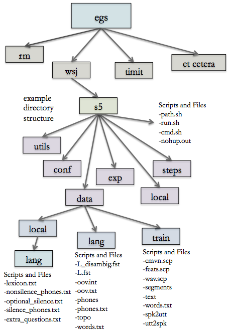

# Familiarization

This section serves as a cursory overview of Kaldi’s directory structure. The top-level directories are `egs`, `src`, `tools`, `misc`, and `windows`. The directories we will be using are `egs` and `src`.  
            
`egs` stands for ‘examples’ and contains example training recipes for most major speech corpora. Training recipes are available for the Wall Street Journal Corpus (`wsj`), TIMIT (`timit`), Resource Management (`rm`), and many others. Under each of these directories are usually a few different versions (`s3`, `s4`, `s5`, etc.) The highest number, usually `s5`, is the most current version and should be used for any new development or training. The older versions are kept for archival purposes only.  
            
`src` stands for ‘source’ or ‘source code’ and contains most of the source code for programs that the training recipes call.  
                
For each training recipe directory, there is a standard sub-directory structure. This is best exemplified in the Resource Management directory (`egs/rm/s5`). The top directory contains the run script (`run.sh`), as well as two other required scripts (`cmd.sh` and `path.sh`). The sub-directories are `conf` (configuration), `data`, `exp` (experiments), `local`, `steps`, and `utils` (utilities). The directories we will primarily be using are `data` and `exp`. The `data` directory will eventually house information relevant to your own data such as transcripts, dictionaries, etc. The `exp` directory will eventually contain the output of the training and alignment scripts, or the acoustic models.
            

